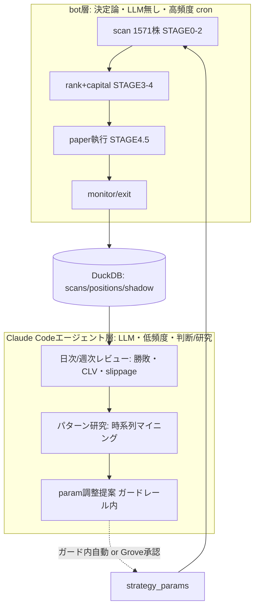
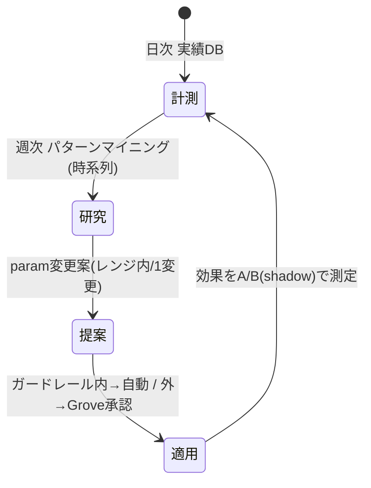
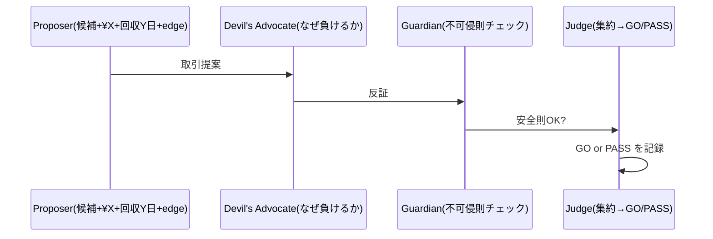

# 設計: ③ grove-stock 運用アーキテクチャ（bot × system × Claude Codeエージェント）

> 2026-05-16。「botで止まってる→AIエージェントチームで継続運用」の本体設計。
> config集約(config_centralization_plan.md)が完了した前提で動く頭脳部分。実装前・要Grove判断。

## 接地（ゼロ設計しない。既存3つに載せる）
- 骨格 = 既存 scan_graph(LangGraph): ingestion→voting→kelly→execution→monitor。**決定論bot部は完成済**
- 資金ルール = 既存 `~/.claude/rules/trading-rules.md`（Tiered Robust Kelly / edge<10%見送り /
  1取引bankroll2%上限 / プール0.5%上限 / 3+基準コンセンサス）。**capital policyはこれを適用**
- 構造 = Grove STAGE 0-5 テンプレ。grove-stock を STAGE に対応づける

## 3層の役割分担（bot / system / Claude Codeエージェント）

- **bot層（速い・毎日）**: 1,571株スキャン→シグナル→ランク→Tiered Kellyサイジング→
  paper執行→監視→決済→DB記録。LLM不要。これは既存scan_graphの拡張。
- **Claude Codeエージェント層（遅い・日次/週次）**: DBの実績を読み、(a)勝敗/CLV/slippage
  レビュー (b)時系列パターン研究 (c)`strategy_params`の調整提案。STAGE5学習。
- 境界原則: **執行は決定論bot（速度・再現性）、判断と進化はLLMエージェント（文脈・研究）**。
  KAIROS原則=正常時のみ自律継続・エラーで即停止・LIVEは絶対Grove承認。

## 1,571株フロー（STAGE対応）

| STAGE | 何を | どこで | 動的か |
|---|---|---|---|
|0 環境|日経MA25レジーム判定|bot ingestion|閾値はparams|
|1 収集|Prime1571の足をcache取得|daily_update cron|—|
|1.5 前処理|MA/RSI/BB/出来高 指標|bot|期間はparams|
|2 予測|P1-P5投票→consensus|bot voting|閾値はparams|
|3 集約|consensus≥c で候補化、**流動性ADVで建玉可否**|bot|c, ADVはparams|
|4 サイジング|Tiered Robust Kelly（trading-rules.md）|bot kelly|tier/上限params|
|4.5 GO/PASS|edge<10%見送り・同時保有上限・重複除外|bot|params|
|5 学習|実績→レビュー→パターン→param提案|**Claudeエージェント**|これが③の核|

## 資金政策（¥1M、Groveの問いに具体回答 — trading-rules.md準拠）

- **5件シグナルが被ったら**: 全部に均等ではない。Tiered Robust Kelly。
  edge（推定勝率×ペイオフ−1）<10%は**見送り**。残りを tier別 fractional Kelly、
  1件あたり bankroll の最大2%、同時に同方向プール0.5%上限。→ 5件でも実際に建つのは
  edge上位の数件、各¥X（=tier×Kelly×¥1M、上限¥20,000/件相当）。
- **回収見込み**: 戦略の保有=最大15営業日／take_profit(MA25回帰)は中央数日。
  → 資金は概ね **5〜15営業日サイクルで回収・再投下**。回収待ちは「拘束資金」として
  capital trackerが把握し、空き枠ぶんだけ新規建玉。
- **枠より多い候補（>同時保有上限）**: ランク関数で選別＝ edge × 流動性 × consensus。
  人間の手選びでなく客観式（君の「AIなら全部見て機械で選べ」）。
- **増やし方**: 月次で realized PnL を bankroll に反映（複利）。DD連動で tier 縮小
  （trading-rules: boat 87%喪失の教訓＝推定誤差+相関無視+slippage無視を回避）。

## 動的調整ループ（STAGE5＝③の心臓）

- 研究の具体例（君の「いつどの株がどうなったパターンか」）: 決まり手別(stop/tp/maxhold)
  勝率の時系列、レジーム別エッジ、業種別、保有日数分布、CLV(Closing Line Value)。
- **1変更ルール**（evolution-rules.md）: 1サイクル1パラメータのみ変更→効果をshadowで
  A/B測定→良ければ採用。総当りでなくOptuna/ベイズ＋ガードレール。
- 評価基準 = 固定param基準（c=3, 年率≈+13%/DD-11.6%, ※新universeで測り直し後）を
  動的調整が walk-forward で上回るか。

## 基幹決定（2026-05-16 Grove確定）

### 1. 自律権限 = paperでは全面自律（trading-rulesも検証対象）
Grove明示「ペーパーで実害ないし自分たちで変えていい。今のルールに縛られて上振れを
潰してる可能性」。→ **2分法を必ずコード化**:
- **可変仮説（paperでAI自律変更可）**: 全strategy_params ＋ trading-rules の資金
  ガードレール（2%/0.5%/edge<10%等）。固定ルールがアップサイドを殺す前提を疑う。
- **不可侵（autonomy外・絶対）**: LIVE切替=Grove承認 / bot無断起動禁止 /
  破壊操作 / 実資金移動。trading-rules緩和=哲学検証であって安全則放棄ではない。

### 2. レビュー頻度 = 週次（LLMコスト×鮮度。保有15日なので週次で十分）

### 3. 取引判断 = エージェント間ディベート（go/pass council）
Grove要請「『この取引は¥X出て回収見込みY営業日、いい？』をエージェント間で議論し
go/pass」。既存DNA再利用（keirin-master の招集→討論→集約、funding STAGE3
guardian/devil's-advocate）。STAGE4.5を council 化:

### 4. PASSも反実仮想で記録（decision_shadow）
Grove要請「passでも"あの時goならこうだった"をデータに残す」。shadow_replay の決定層版＝
`decision_shadow` テーブル: 全 go/pass に proposal(¥X, 想定回収Y, edge, council理由) と
事後の反実仮想結果を記録。**却下からも学習**。CLVと同系の規律。

## OSS活用（接地した第一候補 — 次セッションで6工程精査必須）

自前で書かない（feedback_use_oss_not_custom）。各ニーズに既知の成熟OSS候補。
**未検証＝feedback_oss_analysis_methodology の6工程(実在確認→RCEスキャン→ソース読→
弱点→Markdown化→Phase入力)を次セッションで通すまで採用しない**。

| ニーズ | 第一候補 | 接地メモ |
|---|---|---|
|動的param探索|**Optuna**|既にS5でOptuna移行進行中(memory)。再利用◎|
|パターン/モチーフ発見|stumpy(matrix profile) / tsfresh|「いつどの株がこうなった」時系列マイニング|
|指標メトリクス|empyrical / quantstats|Sharpe/DD/CLV算出。engine.metrics補強|
|ポートフォリオ最適化|PyPortfolioOpt / riskfolio-lib|任意。trading-rules Tiered Kellyが主、補助検討|
|エージェント編成|**LangGraph**(既存) + Claude Code subagent/skill|scan_graph既にLangGraph。新framework不要|
|walk-forward CV|mlfinlab(purged CV)|重い/ライセンス要確認。要6工程|
- 既存backtest engine.py は動作実績あり→OSSで丸ごと置換は高risk。**借りるなら
  metrics層だけ**(empyrical)。コアは温存。

## エージェント組織（サブスク枠内 — 少数精鋭。Grove既存DNA再利用）

制約: Claude Code CLIエージェントは**サブスクプラン内**で回す（phantom-capital
claude_localサブスク枯渇=単一障害点の教訓 memory）。→ **エージェント数を絞る・
週次・ルーチンはhaiku/重判断のみopus**（phantom-capitalのmodel割当流儀: CEO/Architect
=opus, 他=haiku を踏襲）。Pixel-Forge33体のような大組織にしない。

grove-stock専用の最小組織（STAGE/council DNAに対応, 全て週次起動）:

| 役割 | STAGE | 何をする | model案 | 主tool(要研究) |
|---|---|---|---|---|
|Researcher|5|週次パターンマイニング・実績分析|haiku|Optuna/stumpy/DuckDB |
|Strategist(Proposer)|5→4.5|guardrail内param変更案・¥X/回収Y/edge|opus|config, shadow |
|Devil's Advocate|4.5|「なぜ負けるか」反証|haiku|— |
|Guardian|4.5|不可侵安全則チェック(LIVE/bot/破壊)|決定論(LLM不要)|— |
|Judge|4.5→5|council集約→GO/PASS、変更適用、decision_shadow記録|opus|config, DB |
- bot層(scan/執行/監視)はLLM非依存cron＝枠を消費しない。LLMは週次councilのみ。
- 既存パターン再利用: keirin-master(招集→討論→集約)、funding s3-guardian/s3-da
  (不可侵則/悪魔の代弁者)。**ゼロ設計しない**。

## 次セッションの研究TODO（実装前に詰める＝この設計の入力）

<!-- W3 docs-sync 2026-06-13: build_diary末尾 + DB実測と突合して状態注記 -->

1. ~~OSS 6工程精査: Optuna/stumpy/empyrical/LangGraph活用可否と統合点（最優先）~~
   **→ 完了 (2026-05-16)**: `docs/grove-stock/oss_integration.md` に全6工程記録済み。
   empyrical-reloaded 採用。Optuna/stumpy/tsfresh はデータ不足で凍結（S5 データ充足後）。
2. エージェント毎config仕様: 各役割の model / 許可skill / MCP / 参照OSS /
   起動トリガ / 書込スコープ を表で確定（agent定義ファイル設計）
   **→ 未着手**（S1 GO まで凍結）
3. サブスク枠の実コスト試算: 週次council 1回のtoken×LLM単価、枠内に収まるか実測
   **→ 未着手**
4. ~~capital tracker / decision_shadow / walk-forward harness の実装設計~~
   **→ 一部完了**:
   - `decision_shadow` テーブル: 実装済 (2026-05-20、DB実測 2,428 records, 〜2026-06-12)
   - apply/revert harness: `src/measurement/discipline_apply.py` 完了 (2026-05-19)
   - `capital_state` テーブル: 既存 DB に存在、book ごとの HWM/cushion 管理済
   - **残**: S1 GO 後の walk-forward harness 本格実装
5. 部署観点: grove-stock単体か、他PJ(funding/keirin)と共有の「研究部」に集約か
   （組織としての流れ。Grove判断要）
   **→ 未決定**（Grove 承認待ち）
