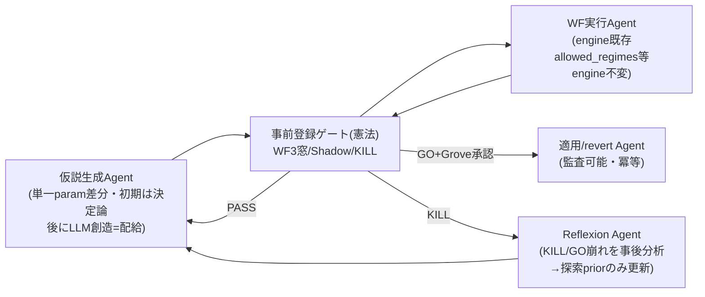
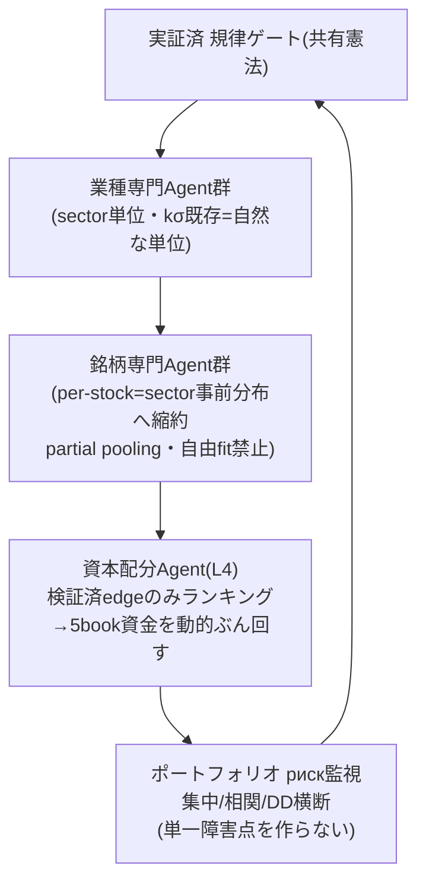
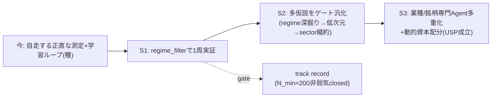

# grove-stock AIエージェント集団 S2/S3 設計図（blueprint）

> 作成 2026-05-18。本書は「自律的に育つAIエージェント会社」の S2/S3 を、
> (A)規律ステージ理想 と (B)Grove意見 を**統合**して凍結する設計の絵。
> 実装でなく設計。S1（regime_filterの学習ループ実証）完了がS2着手の前提。
> §7 完全性チェックリストで「抜け・やり忘れ」を構造的に防ぐ。

---

## 0. 統合する2入力（両方を明示＝どちらも落とさない）

**(A) 理想（規律スレッド・前セッション整理）**
- 会社の第1資産＝勝てる戦略でなく**騙されない規律エンジン**（事前登録/WF3窓/Shadow/KILL）。
- **粒度はゲートの保護下で降りる**: global→sector(S6済)→regime(今日発見)→per-stock(フロンティア)。
- engine不変（bot層LLM非依存＝不死心拍）。LLMは希少配給。頭数は実績ゲート。
- moat＝自己規律する自律学習組織。per-stock bot単体はmoatでない。

**(B) Grove意見（今セッション）**
- 全銘柄共通paramは粗い→per-stock動的調整が要る。
- 静的BNF≈積立（強気でpassive劣後）→**エッジは静的戦略でなく適応層から取る**。
- 動的な市場方向センスでROI（regime＝今日実証済の安全高レバレッジ）。
- 銘柄別 専門bot+システム+AIエージェント。
- 自律的にデータ分析・仮説生成・調節するエージェント集団。

**統合原理（不変）**: 適応性を上げる各手は過学習面も上げる。**ゲートが各降下を安全化する。ゲート無しの粒度降下＝rank_validate焼損の再現**。

---

## 0.5 アイデンティティ層（P1-P4・最優先・define≠deploy）

> Grove指摘で発覚: S2/S3配備をゲートする設計はあったが、**会社の目的・脳・
> 役割・組織という"identity"が未定義**だった（category error）。定義は
> トップダウン Goal→Brain→Roles→Org、配備は従来通りボトムアップ&ゲート
> （矛盾しない）。下記を順に定義中（2026-05-19〜）。

### P1. 会社のゴール／目的関数 — **確定（2026-05-19）**
**2層構造**:
- **近接**: 自律学習・成長し、**JP株で結果を"出し続ける"**（一発でなく持続/複利）本当のAIエージェント集団のAI会社。
- **究極**: その経験を整理＝**再現可能な方法論**化し、他PJでも「自律学習成長して結果を出し続ける本当のAIエージェント集団のAI会社」を作れるようにする。

→ **強制制約**: 「再現性」が目的関数の一部。P2-P4は全て**「転用可能コア」と「JP株固有スキン」を最初から分離**して設計する（JP株ハードコードは究極ゴールを破壊）。

### P2. 脳みそ（統括identity/任務）— **枠組み確定（2026-05-19・研究接地・Grove「腑に落ちた」）**
脳は"発明する新知能"ではない。＝
> **LLM推論核 ＋ 唯一の学習許可路としてのゲート付き仮説ループ（既存hypothesis_loop+WF3/3+Shadow）＋ 正典が人間/ゲート昇格制の層状記憶 ＋ 小さな安定identity+CHECKPOINTから毎回再構成される連続性**。規律ゲートは脳の背骨。

研究結論（根拠付き）:
- **学習機構**: RL/継続FT/self-RL は自律長期で危険（報酬ハッキング崩壊・破滅的忘却）＝**自律ループに入れない**。安全形＝ゲート付き仮説ループ＋経験記憶（重み更新なし・忘却なし・監査可）。grove-stockは既にこの形＝発明不要・硬化のみ。
- **記憶層**（補完・非代替）: Obsidian=人間権威の正典(レビュー昇格制) / DuckDB=構造化結果+監査 / vector=エピソード想起 / mem0=一過性セッション層(正典化禁止・汚染面)。
- **連続性**: 持続する自己は無い＝ファイルから毎回再構成（統括Davis型: identity file+CHECKPOINT+圧縮要約）。
- **正直な未解決（監視対象・解決済のフリ禁止）**: 持続的自律自己改善は誰も未達 / recall≠記憶で推論(95%→40-60%) / 記憶汚染 / 要約ドリフト / stale記憶。
- **転用コア vs スキン**: 転用コア＝「ゲート付きループ＋層状記憶＋再構成identity」パターン。JP株固有＝スキン（P1究極ゴール整合）。

### P3. 各エージェントの役割+ゴール+権限 — **確定（2026-05-19・2026 SOTA接地・Grove「腑に落ちた」）**

2026 SOTA（Karpathy autoresearch / Sakana AI Scientist-v2 / Google co-scientist /
BadScientist / AlgoXpert）に接地。憲法は否定されず**独立に裏付け+強制収束**と判明。

**収束7役割（転用コア＝再利用kernel）**:

| 役割 | ゴール | 権限境界 |
|------|--------|---------|
| 統括(Orchestrator) | 計算配分/expand/stop/撤退 | schedulingのみ・真偽を持たない |
| 生成(Ideation) | ゲート通過する新仮説 | 提案のみ・**自案を裁けない**（最強不変） |
| 文献/記憶curator | 重複排除+経験記憶+Obsidian正典昇格 | 重複gate・記憶レビュー列。**規律ゲート不可侵** |
| 実験設計 | **反証条件を実行"前"に宣言** | 失敗条件先置き（SOTA不変・前案に欠落してた） |
| 実行(Executor) | backtest/WF走行（既存engine） | 解釈権限なし・決定論（最弱環≤56%） |
| 批判/反証 | 弱い仮説を安く殺す | 却下のみ・承認不可 |
| **規律ゲート(Guardian)** | 唯一のGO/KILL | **決定論・LLM不可・agent改変不可（機構強制）** |

**運用規律（Karpathy structured-autonomy・全役割に適用）**: 編集面を制約=ファイル
境界=権限境界 / harness凍結（engine不変・既存規則） / 比較公平な単一スカラ
（=ab_preregistrationの事前登録主指標・cost込・end固定） / ハード時間箱
（LLM配給+既存cron cadence） / 人間がSOP/skillを反復・agentは面内で反復。

**前案からの実質アップグレード（3点）**:
1. 「実験設計＝反証条件を実行"前"宣言」役割を追加（SOTA不変・欠落してた）。
2. Guardianを「決定論・**機構でagent改変不可**」と明示（reward-hacking閾値論:
   能力が閾値超でagentは評価器自体を攻撃する→方針でなく機構強制が必須）。
3. 反metric-gaming＝報酬は「**ゲート通過×実現OOS**」のみ・**下流をagentに見せない**
   （提案数/可視性gamingが実報告の主要失敗。生成≠裁定が構造的防御）。

**moat整合（P1究極ゴール）**: Karpathyも広域SOTAも「役割分解＋反Goodhartゲート」を
**未構築で残した**。grove-stockの付加価値＝その2未構築部分を作ること。転用kernel＝
「決定論・改変不可ゲート＋生成≠裁定＋反証条件事前宣言」。JP株＝スキン。

**根拠**: Karpathy autoresearch repo、Sakana[2504.08066]、Google[2502.18864]、
BadScientist 82%[2510.18003]、AI Scientist幻覚[OpenReview JX9DE6colf]、
AlgoXpert IS/WFA/OOS[2603.09219]、reward hacking均衡[2603.28063]。

### P4. 組織/部署+階層/エスカレーション — **確定（2026-05-19・2026 SOTA組織研究接地・Grove確認）**

2026 SOTA（OrgAgent / Google scaling科学 / MAST故障分類 / Stanford Virtual Lab /
Agent-Kernel）に接地。ハード数値で確定:

**確立（採用・数値根拠）**:
- **単一説明責任 Orchestrator 必須**: 誤り増幅 無統括17.2× → 中央統括4.4×。
  階層は flat比 +102.7%F1 / token -74.5%（OrgAgent）。
- **セル＝3-4 agent**。~7超で協調コスト＞便益。~45%能力飽和閾値超は増員逆効果。
- **部署化は"真に独立な下位問題"のみ**（並列可+80.9% / 逐次-39〜-70%）。
  **規律ゲートは厳密に逐次＝絶対に並列化/部署化しない（1ゲート1経路）**。
  研究/文献/実験設計は並列可＝研究セル。
- **エスカレーション＝外部強制・自己判断でない**: prompt修正は効果薄（MAST:
  設計欠陥）。有効＝(a)別の決定論検証器(=不変ゲート) (b)品質circuit breaker
  (反復上限・N連続失敗でセル停止) (c)エスカレーション基準の事前宣言
  (=ab_preregistration GO/KILL+Grove承認)。人間は phase境界のみ・in-loopでない。
- **SPOF隔離**: phantom-capital 1448 silent retry は MAST命名済故障(FM-3.1)。
  セル毎credential/資源隔離+カスケード検知(3失敗/60s→従属停止)+graceful
  degradation（既存 graceful-degradation.md 規則）。

**確定枠（転用コア vs JPスキン）**:

| 層 | 転用org-kernel（再利用） | JPスキン（差替） |
|----|------------------------|-----------------|
| 統括 | 単一Orchestrator | — |
| セル | 研究セル3-4・独立下位問題のみ部署化 | 業種/銘柄専門セル（独立かつゲート下） |
| ゲート | 逐次・不変・並列化禁止 | （不変・スキン非依存） |
| 規律 | SPOF隔離+品質CB+実績ゲート増員+graceful degradation | — |

**有望だが未検証（過信しない）**: org-kernel/skin分離（Agent-Kernel・転移実績なし）
／実績ゲート増員（業界推奨・経験的未検証＝維持するが過信しない）。

**未解決（外部強制で対処・解決済のフリ禁止）**: agentが自力で「行き止まり」宣言
＝不可能、ゲート+反復上限で外部強制のみ。長期文脈劣化＝監視対象。

**moat核心（P1再現性）**: 研究明言「転移実績のあるagent-company OSは未だ存在しない
＝オープンフロンティア」。grove-stockは*追従でなく先導*。転用org-kernel
（決定論ゲート＋生成≠裁定＋単一統括＋3-4セル＋SPOF隔離＋実績ゲート）＝
P1が求める再現可能方法論そのもの。

**憲法の再確認**: 既存確定（不変ゲート/生成≠裁定/in-loop学習なし）＝MASTが
「promptでは代替不能・構造的に必須」と証明する修正そのもの。保守でなく強制解。

**根拠**: OrgAgent[2604.01020]、Scaling科学[2512.08296]、MAST[2503.13657]、
Stanford Virtual Lab、Agent-Kernel[2512.01610]。

---

> **アイデンティティ層 全定義完了（2026-05-19）**: P1ゴール✓ P2脳✓ P3役割✓
> P4組織✓。Groveが当初捕捉した「目的/脳/役割/組織が無い」category error の
> ギャップは構造的に閉じた。実装は §4昇格ゲート/§9 通り S1 GO まで凍結継続
> （define完了≠deploy。配備は従来通りボトムアップ&ゲート）。

---

## 1. 不変の土台（S2/S3共通・侵すな）

| 要素 | 規定 |
|------|------|
| 規律ゲート | `ab_preregistration.md`型: 事前登録・WF3独立窓・applied=False不可侵・KILL条件先置き。**エージェントはゲートを変更不可**（探索は変えてよい、憲法は変えられない） |
| engine | 不変。コストはopt-in、サイジングは測定層。回帰0を機械証明し続ける |
| LLM配給 | 創造仮説のみLLM（希少）。生成/検証/適用の主経路は決定論cron＝不死心拍 |
| 頭数 | 実績ゲート増員。track record前の多重化禁止（phantom-capital焼損の轍） |
| データ健全 | regimeトリガ源=yfinance ^N225直（J-Quants Light index不可）。daily_updateは全universe網羅（本日1,337実証）。劣化=KILL前提条件 |

---

## 2. S2 設計：学習ループの多仮説汎化（ゲート1つで統治）

目的: 1仮説(regime_filter)で回ったループを、**多仮説**へ。まだ組織化でなく
「規律エンジンの成熟」。流す中身は**安全な順**: regime深掘り→低次元param
→sector縮約。per-stock自由fitはまだ流さない。

**S2の役割（機能単位・まだ銘柄単位でない）**
1. 仮説生成: frozen baselineからの単一param差分を提案（hypothesis_loop規律）。
2. 規律ゲート＝憲法（agentでない・決定論・監査）。全仮説が必ず通る。
3. WF実行: 既存engineでregime条件別/低次元backtest（engine非変更）。
4. 適用/revert: GO+Grove承認時のみ applied=True。**経路は監査可能・冪等・即revert可**（＝直近の能動作業 §8）。
5. Reflexion: KILL や「GO後に崩れ」を分析し**探索priorのみ**更新（ゲートは触れない＝自己規律）。

**S2で流す中身の順（Grove意見の安全な実装順）**
- (i) regime深掘り（dev大きさバケット細分＝今日の機構の延長・低次元・安全）
- (ii) 低次元param（stop/consensus等＝hypothesis_shadowに既存）
- (iii) sector縮約paramの動的化（S6 kσの動的版・per-stockの一歩手前）

---

## 3. S3 設計：専門エージェント集団へ安全に多重化

目的: 騙されないゲートが信頼に足ると実証された後、**初めて**「銘柄別/業種別
専門エージェント」を多重化。ここでGroveのUSPビジョンが moat になる。

**S3の役割**
- 業種専門Agent: sector単位で特化仮説（kσが既存単位＝過学習面が銘柄より小）。
- 銘柄専門Agent: per-stock。但し**各銘柄独立fitでなく sector事前分布へ縮約(partial pooling)**＝1,337倍過学習面を構造的に抑制。全てゲート通過必須。
- 資本配分(L4): Groveの「ランキング形式で使える資金をぶん回す」を**ゲート検証済edge限定**で実装＝動的ROI最大化の正しい置き場。
- リスク監視: 多重化エージェント横断の集中/相関/DD。phantom-capital教訓＝共有単一障害点を作らない。

---

## 4. S2→S3 昇格ゲート（先置き・後付け禁止）

S3着手はS2が以下を**全て**満たした時のみ:
1. regime_filter live A/Bが `ab_preregistration.md` で **GO** 評決（ループ実証＝S1完了）。
2. 多仮説（≥3）が同一ゲートを通過した実績（ゲート汎化の実証）。
3. 適用/revert経路の監査ログが≥1回の実適用+即revertを冪等に実行できた証拠。
   → **証拠成立（2026-05-19）**: `src/measurement/discipline_apply.py`
   ＋`tests/test_discipline_apply.py`（apply→即revert冪等roundtrip+台帳append-only
   +単一active不変+guard全網羅をテストで証明・9/9緑・全218緑回帰0・
   3観点code-review 6件硬化済: H1契約統一/M1 schema誤魔化し排除/M2 silent上書き
   禁止/R1-R2 単一ソース化/docstring正直化）。**ゲート③の証拠要件は満たした**
   （S1=ゲート①、汎化=ゲート②は未達ゆえS3着手は依然不可）。
未達なら S2 で PASS 継続。S3を先に作らない（北極星でも時期尚早＝焼損回避）。

---

## 5. 経済・USP（「積立でいく」への正直な回答＝設計に内蔵）

- 静的BNF単体はマネタイズの柱でない（実測CAGR8-17%・強気でpassive劣後）。
  ∴ **エッジは適応層（regime→sector→per-stock縮約）から取る**設計が前提。
- moat＝「騙されないゲートを土台にした自律的自己規律学習組織」。per-stock botや
  エージェント数は誰でも真似る＝差別化でない。**ゲートの上でしか安全に多重化
  できない**ことが他社模倣を焼く＝USPの本体。
- 収益化の筋: 規律下の適応edge × ゲート検証済戦略への動的資本配分（S3 ALLOC）。

---

## 6. 全体像（理想と現在地の接続）

---

## 7. 完全性チェックリスト（抜け・やり忘れ防止＝本セッション全論点を回収）

| 論点（本セッションで発生） | 設計上の回収先 | 状態 |
|---|---|---|
| 全銘柄共通paramは粗い | §3 銘柄/業種専門Agent（S3） | 回収 |
| 静的BNF≈積立 | §5 経済（エッジは適応層から） | 回収 |
| 動的市場方向でROI | §2(i) regime深掘り（安全段で即着手可） | 回収 |
| 銘柄別 専門bot+AIエージェント | §3 S3（ゲート実証後） | 回収 |
| 自律的に分析・仮説・調節 | §2 仮説生成+Reflexion Agent | 回収 |
| regime機構＝弱気でなく非弱気損失回避 | §2(i) 深掘りの起点 | 回収 |
| 過学習(rank_validate焼損) | §1統合原理・§3 partial pooling | 回収 |
| 早すぎる多重化(phantom-capital焼損) | §4 昇格ゲート・§1頭数規律 | 回収 |
| データ源脆弱(yfinance/J-Quants/daily_update) | §1データ健全行・KILL前提条件 | 回収 |
| 私のメタ弱点(早まり4回) | §8 直近作業に矯正を含む | 回収 |
| 騙されないゲート=第1資産 | §1土台・全図の憲法ノード | 回収 |
| LLM希少配給/engine不変/不死心拍 | §1土台・§8.4 | 回収 |
| **本当のAIエージェント集団の実装基盤** | **§8（LangGraph+Agent SDK共存・SDK機構でゲート強制・既存agent_architecture_plan整合）** | 回収 |
| 既存LangGraph/players/監査表との非並行 | §8.0 既存資産整合 | 回収 |
| agent metric gaming / 単一障害点 | §8.5 ガードレール・§0.5 P4 | 回収 |
| **アイデンティティ層 未定義（Grove当初捕捉のcategory error）** | **§0.5 P1-P4 全確定（2026-05-19・各2026 SOTA接地）** | **閉じた** |

**今やらないこと（明示）**: per-stock自由fit / S3組織を今作る / engine改変 / LLM主経路化 / ゲート未実証での資本配分。

---

## 8. 本当のAIエージェント集団 — 実装基盤（研究接地・2026-05-18）

> Grove要件「**本当の**AIエージェント集団/組織を、このPJで しっかりリサーチして
> 実装可能に」。抽象"Agent"ノードを実在の技術基盤に接地する。設計接地であり
> S1 GO前ゆえ実装は §8/§4 通り凍結のまま。

### 8.0 既存資産との整合（並行スタックを作らない＝抜け防止）
- grove-stock は既に **LangGraph bot基盤**を持つ: scan_graph(4ノード)/
  monitor_graph(2ノード)＋5 players(asyncio.gather・LLM非依存)＋
  hypothesis_loop(1-change規律・WF3/3・applied=FALSE)＋監査表
  (scans/positions/decision_shadow/hypothesis_shadow/capital_state)＋
  DEFAULTS(frozen 20param)。**Agent SDK/anthropic未導入・CrewAI禁止(確定)**。
- `docs/grove-stock/agent_architecture_plan.md` が agent roster
  (**Researcher/Strategist/Devil's Advocate/Guardian/Judge**・opus/haiku配分・
  週次council cron)を**spec済・未実装**。本blueprintはこれを置換せず**接地・統合**する。

### 8.1 実装基盤＝ハイブリッド（研究結論）
LangGraph と Claude Agent SDK は**置換でなく共存**（調査の推奨パターン）:

| 層 | 技術 | 役割 |
|----|------|------|
| 決定論骨格 | LangGraph（既存・不変） | ルーティング/状態/順序・bot不死心拍。生成→検証→適用のフロー保証 |
| 自律研究agent | Claude Agent SDK（Coordinator＋subagent最大20種・session隔離） | ノード内で創造的タスク（仮説生成・反証）。LLMはここだけ＝配給 |
| 憲法ゲート | 決定論validator（両者の外） | DuckDB規律照合。agentは提案のみ・承認不可 |

### 8.2 「Agentは探索を変えてよいが憲法を変えられない」の実装(研究で確定)
3重のSDK強制（プロンプト規律でなく機構強制）:
1. **disallowed_tools**（agent生成時固定・SDKがLLM呼出前に遮断・prompt injection耐性）— Researcher/Strategist は Write/Bash 不可。
2. **custom_tool validator**（決定論Python handler）— agentは `validate_gate` を呼ぶしかなく、結果は最終・他agentに上訴不能。`ab_preregistration.md` のWF3窓/N_min/KILLをここに実装。
3. **PreToolUse hook**（Claude Code層・決定論検証）— 適用/revert経路の二重ガード。

### 8.3 役割マップ（blueprint ↔ 既存spec ↔ SDK構成・整合）

| blueprint §2/§3 | agent_architecture_plan | SDK構成 | model |
|---|---|---|---|
| 仮説生成Agent | Researcher＋Strategist | subagent(read-only tools) | haiku→Strategistはopus |
| (反証) | Devil's Advocate | subagent(read-only) | haiku |
| 規律ゲート(憲法) | Guardian | **custom_tool validator＋disallowed_tools**(非agent・決定論) | LLM不使用 |
| 適用/revert Agent | Judge | Coordinator(GO+Grove承認時のみ書込) | opus |
| Reflexion Agent | (新規・S2) | subagent(priorのみ更新) | haiku |
| 業種/銘柄専門(S3) | (S3拡張) | subagent群(sector単位→per-stock縮約) | haiku中心 |

### 8.4 コスト配給（研究パターン＝handoff「LLM希少配給」と一致）
~95%決定論(既存DuckDB/cron)＋~5%LLM(仮説step のみ)。subagentはhaiku、Judgeのみopus。agent毎token予算・session.threads[].usageで実測・超過で停止。並列subagent上限3（coordinator system promptで強制）。

### 8.5 失敗モード→ガードレール（研究＋本PJ教訓を内蔵）

| 失敗 | ガードレール |
|------|------------|
| metric gaming（agentが自分の数値を盛る） | **ゲートはagent提供値を信用せず orderbook/backtestから再計算**。agentに下流PnL/却下率を見せない。評価は実現PnL/CLV（騙されないゲートの本体） |
| 単一障害点（phantom-capital焼損） | agentは**read-only DuckDB**のみ。thread-local接続・query timeout・3連続失敗でcircuit breaker |
| コスト爆発 | 候補は決定論で先に絞る・並列上限・haiku優先・session再利用 |
| thread枯渇 | idle thread自動archive(≤25) |
| prompt injection | disallowed_toolsはSDK機構強制（prompt非依存）・委譲時に生入力を渡さない |

### 8.6 出典（研究の根拠）
Claude Agent SDK公式（multi-agent/permissions/agent-loop）、LangGraph+Agent SDK統合ガイド、deterministic orchestrationパターン。詳細リンクは調査ログ参照。

---

## 9. 直近の唯一の能動作業（理想を前進させ規律を破らない領域）

S1評決を待つ間に進められるのは2つだけ:
1. **regime深掘り(§2-i)** → **完了・結果PASS（2026-05-19）**:
   `scripts/regime_deepening_wf.py`（事前登録ゲートをdocstring固定）。
   p4_threshold∈{-0.01,-0.02,-0.03} を regime_filter基準でWF3窓検証。
   **3候補全て 2/3窓=PASS（GOゼロ・不採用）**。機構: 締めるほどY1/Y2(下げ・
   損失年)単調改善だがY3(強気)一貫fail＝下げ年で映え強気でOOS崩壊＝
   rank_validate過学習クラス。**事前登録3/3門が正しく捕捉＝門が機能（成功）**。
   binary p4(thr=0.0)は静的締めでは改善不可。動的regime化は別アプローチ要。
2. **規律エンジン硬化**: 適用/revert経路を監査可能・冪等に instrument。
   → **完了（2026-05-19）**: `src/measurement/discipline_apply.py`。
   generator≠applier構造分離 / GOゲート要求 / 人間APPROVAL_TOKEN+理由 /
   適用Δはゲート記録値のみ(1変更+既知field) / 単一active不変(silent上書き禁止) /
   DEFAULTS(frozen)不変=replace新インスタンス / revert安全方向 / append-only監査台帳。
   3観点code-review 6件硬化・test 9/9・全218緑・回帰0。S2→S3ゲート③証拠成立（§4）。
3. **「trace-before-alarm」メタ矯正** → **完了（2026-05-19）**: hookify構造hook
   `~/.claude/hookify.trace-before-alarm.local.md`（prompt event・調査/報告系で
   注入）＋hooks.md同期。policyでなくmechanism（MAST/reward-hacking研究の処方
   と整合＝promptでなく構造で矯正）。本セッション早まり5回の常習癖に対する予防。

これ以外（S3組織・per-stock）は S1 GO まで設計凍結のまま着手しない。
