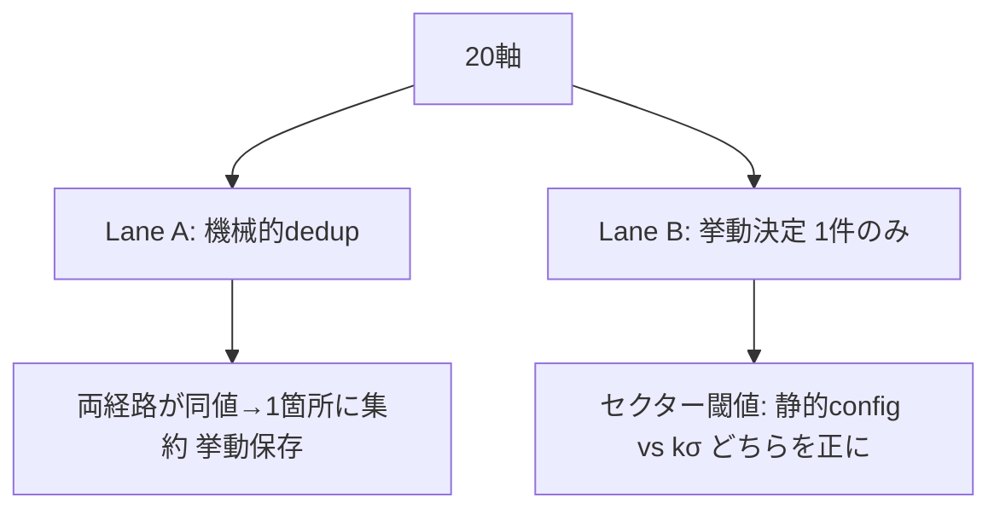
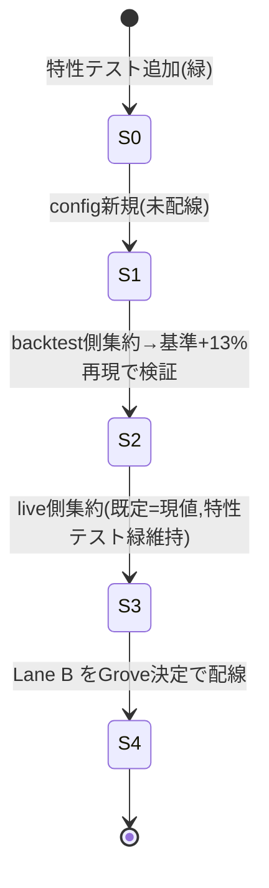

# 設計: 戦略パラメータの単一config集約 + live/backtest統一

> 2026-05-16 作成。③(AIエージェント動的調整)の前提整備。実装前のGrove承認待ち。

## なぜやるか（Context）
③「AIエージェントがparamを動的調整したら基準値(c=3固定 年率≈+13%/DD-11.6%)を超えるか」を
将来やるには、**調整できる単一のツマミ盤**が要る。今は同じ値が2箇所に重複定義され、
全プレイヤーが内部ハードコード、live と backtest が別の閾値ロジックを使う。この状態では
エージェントが値を変えても効かない／基準と比較できない。

## Phase1要約（このセッションで測定済 — 再探索不要）
全該当ファイル実読済。20軸を棚卸し（build_diary参照）。重複・分岐は把握済。

## 2レーン分離（最重要の設計判断）



- **Lane A（挙動保存・機械的）**: stop_loss(-0.07)、max_hold(15)、max_concurrent(7)、
  consensus(3)、MA25/RSI14&35/BB25&2、kelly配分、ADV、floor/ceiling、regime境界、
  take_profit閾値(0)。**現状live値とbacktest値は一致**しているので1箇所集約は純粋に
  挙動保存（特性テストで証明）。
- **Lane B（挙動決定・要Grove承認）**: セクター乖離閾値のみ。live=`config/sector_config.py`
  静的13銘柄+既定-0.07／backtest=`universe.compute_sector_thresholds`(−k·σ,k=2.0)。
  ここを統一すると**どちらかのlive挙動が変わる**＝リファクタでなく意思決定。

## 単一configスキーマ
`config/strategy_params.py`（pydantic不採用＝新規依存回避。repo既存流儀の`@dataclass(frozen=True)`）

```
@dataclass(frozen=True)
class StrategyParams:
    ma_period:int=25; rsi_period:int=14; rsi_threshold:float=35
    bb_period:int=25; bb_std:float=2.0
    p4_threshold:float=0.0; p4_required:bool=False
    p5_vol_lookback:int=3
    consensus_min:int=3
    stop_loss:float=-0.07; max_hold_days:int=15; take_profit_dev:float=0.0
    max_concurrent:int=7
    kelly_alloc:dict=({3:0.10,4:0.15,5:0.20})
    adv_min_jpy:float=1e8; th_floor:float=-0.20; th_ceiling:float=-0.03
    sector_k:float=2.0
    sector_threshold_mode:str="ksigma"   # Lane B: "ksigma" | "static"
DEFAULTS = StrategyParams()
```
live経路もbacktest経路もこの`DEFAULTS`を唯一の参照元にする。

## 変更ユニット（file → change → why）

| # | ファイル | 変更 | why | リスク |
|---|---|---|---|---|
|0|tests/test_characterization.py|新規。現live挙動(p1-5/consensus、engine.metrics)をgolden固定|挙動保存の証明土台|なし(追加) |
|1|config/strategy_params.py|新規。StrategyParams + DEFAULTS(=現値)|単一ソース|なし(未配線) |
|2|src/backtest/engine.py|定数→DEFAULTS参照(引数default化)|backtest側集約。cron非依存で低risk|中(基準再現で検証) |
|3|src/players/p01-p05.py|`vote(df,**kwargs)`に`params`受領(既定DEFAULTS)|live集約。signature非破壊(kwargs既存)|中(特性テスト) |
|4|src/voting.py,src/monitor.py|CONSENSUS/STOP_LOSS/MAX_*をDEFAULTS参照、paramsをvoteへ伝播|重複2箇所定義を解消|中 |
|5|src/main.py|MAX_CONCURRENT等DEFAULTS参照|重複解消|低 |
|6|(Lane B)src/players/p01.py,universe|Grove決定後: 閾値モード分岐を配線|挙動決定の反映|高(挙動変更) |

## 移行順序（live cron稼働させたまま）


各Sは独立コミット。S3完了まで cron(--paper 9:00/12:30/15:00, daily_update15:30)は
旧挙動のまま動き続ける。問題時は当該Sをrevertでロールバック。

## 受入基準（検証方法）
1. 既存142 + 新特性テスト 緑（`PYTEST_DISABLE_PLUGIN_AUTOLOAD=1 pytest tests/ -m "not integration"`）
2. S2後: 3年バックテスト再実行で **c=3が決着≈477/勝率≈60.0%/+0.90%/maxDD≈-11.6% を再現**
   （=backtest側集約が挙動保存できた証明、/tmp/bt3y.py相当）
3. paper疎通維持: `test_paper_mode.py` 緑（execution_nodeが実終値約定）
4. Lane B 配線後のみ意図的に基準が動く → その差分を別途数値報告

## Lane B 決定済（2026-05-16 Grove）= **B1: kσに統一**
セクター閾値は `universe.compute_sector_thresholds`(−k·σ, k=2.0, floor-0.20/ceiling-0.03)
に統一。live p01 は `config/sector_config.py` 静的13銘柄mapの参照を廃し、kσ計算結果を
参照する。結果: live挙動が変わり、本日測定の3年基準(c=3 ≈+13%/DD-11.6%)が
そのまま live の正式基準になる。`sector_threshold_mode` フィールドは "ksigma" 固定で
保持（将来③でエージェントが触れる余地として残すが既定固定）。

## 軸: ユニバース幅（2026-05-16 Grove強い要請「13/手選びでなく全部対象」）

実測: J-Quants get_list=4,446（Prime1,571 / Standard1,578 / Growth598 / 他699）。
現live=494（TOPIX500相当の手選びサブセット）。

**Grove決定（2026-05-16）= Prime全1,571 + ADV流動性フィルタ**。Standard/Growthは
含めない（薄商いノイズ＋約定非現実＋計算7倍を回避）。手選びTOPIX500サブセットは廃止。

設計方針: **手選び（scale_categories固定）を廃し、全Primeを母集団に客観的流動性
フィルタ（ADV）で建玉対象を機械決定**。「AIが全部見る／執行可能なものだけ建てる」。
StrategyParams に以下を第一級axisとして追加:
- `universe_market: tuple = ("Prime",)`（既定。将来 +Standard/Growth 可）
- `universe_scale: tuple | None = None`（None=ScaleCat絞りなし＝Prime全1,571）
- `adv_min_jpy: float = 1e8`（既存。建玉可否の客観ライン。③でエージェント調整余地）

**代償（必ず明記）**: ユニバース変更で本日の3年基準(+13%/-11.6%, 494銘柄)は無効化。
拡張後の母集団で基準を測り直す（S2同様 engine.run_backtest を新universeで再実行）
のが受入条件に加わる。

実装影響: `universe.fetch_universe(scale_categories=...)` を params 駆動に。
キャッシュ未収銘柄(現494→最大1,571)は daily_update/bulk_fetch で拡充が必要
（J-Quants throttle ~0.4s×1,571 ≈ 10分強／増分は軽い）。これは別S（S7: universe拡充
バッチ）として分離、cron daily_update に統合。

### S6（Lane B）の追加詳細
- live経路で kσ閾値をどう供給するか: `universe.compute_sector_thresholds` は J-Quants
  API直叩きで重い。live scan は cache 版 `runner.compute_sector_thresholds_from_cache`
  を日次1回計算し DuckDB か config に保存→ scan時はそれを読む（API毎回叩かない）。
  daily_update(15:30 cron)直後に閾値再計算を足すのが自然な配線点。
- p01 は ticker→S33業種 を引いて閾値辞書を参照（universe.get_threshold_by_sector を再利用）。
- 受入: S6適用後の live scan が出すセクター閾値が、基準backtestの閾値と一致することを
  数値で突き合わせ（同一k=2.0・同一cache → 一致するはず）。
